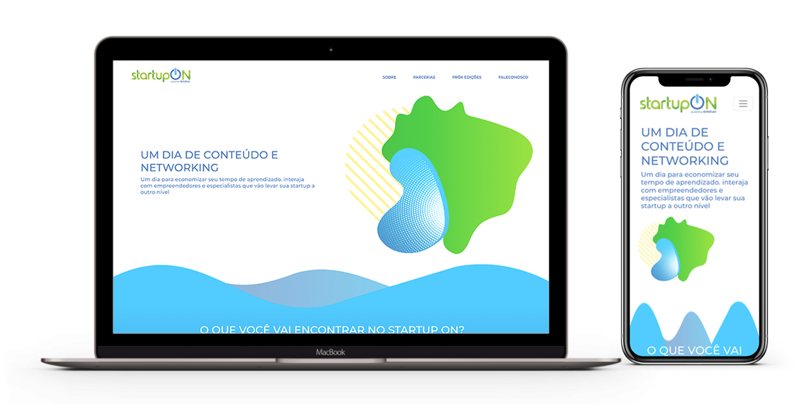

# DESAFIO ABS
Associação Brasileira de Startups
REACTJS 16.13.0
Gerenciador de pacotes YARN.

# MODELO RESPONSIVO

Para baixar o conteudo do projeto
[https://github.com/mrdouglasmorais/desafio-abs](https://github.com/mrdouglasmorais/desafio-abs)

## yarn start
Inicia aplicação no modo desenvolvimento.

Para acessar local [http://localhost:3000 ](http://localhost:3000 )para visualizar no navegador.

## yarn build
Para bildar o conteúdo.
Ambiente de produção.

Para visualizar
Ambiente de homologação
[https://desafio-abs.netlify.com](https://desafio-abs.netlify.com)

## dependências:
react
react-dom
react-scripts
react-bootstrap
node-sass
fortawesome
react-spring-3d-carousel
uuid

## estilização:
Sass - scss

Por Douglas Morais
mr.douglasmorais23@gmail.com

11 9 8035.8443